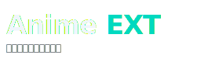

<p align="center">
  
</p>


AnimeExt es un servidor web diseñado para la visualización de anime mediante streaming.

Instalación
===========

1. Instala las dependencias:

   ```bash
   npm install
   ```

2. Inicia el servidor:

   ```bash
   npm start
   ```

3. Abre el navegador en:

   ```
   http://localhost:{PORT}
   ```


Consideraciones
===============

- Este proyecto no almacena ni redistribuye contenido multimedia.
- Todos los enlaces de reproducción son obtenidos en tiempo real desde fuentes públicas mediante navegación automatizada.
- AnimeExt está diseñado únicamente con fines educativos, de prueba o desarrollo personal.
- El uso de este software para propósitos comerciales o de redistribución puede violar los términos de uso de terceros.
- AnimeExt no esta monetizado, ni contiene anuncios.

# Estructura del proyecto:
```text
├── animeext.log
├── data
│   ├── anime_list.json
│   ├── lastep.json
│   ├── tmp_aniyae.json
│   ├── tmp_flv.json
│   ├── tmp_jk.json
│   ├── tmp_one.json
│   ├── tmp_tio.json
│   └── UnitID.json
├── DOCUMENTATION.md
├── ejemplo.rest
├── init.sh
├── LICENSE
├── main.js
├── node_modules.bin
├── package.json
├── package-lock.json
├── public
│   ├── 404.html
│   ├── app.html
│   ├── app_redir.html
│   ├── dev
│   │   └── log.html
│   ├── img
│   │   ├── 404.png
│   │   ├── app
│   │   │   ├── Screenshot_2025-11-14-21-38-37-235_com.chikyqwe.animeext.jpg
│   │   │   ├── Screenshot_2025-11-14-21-38-57-530_com.chikyqwe.animeext.jpg
│   │   │   ├── Screenshot_2025-11-14-21-39-03-089_com.chikyqwe.animeext.jpg
│   │   │   ├── Screenshot_2025-11-14-21-39-08-809_com.chikyqwe.animeext.jpg
│   │   │   ├── Screenshot_2025-11-14-21-39-22-788_com.chikyqwe.animeext.jpg
│   │   │   ├── Screenshot_2025-11-14-21-39-31-267_com.chikyqwe.animeext.jpg
│   │   │   ├── Screenshot_2025-11-14-21-39-43-930_com.chikyqwe.animeext.jpg
│   │   │   ├── Screenshot_2025-11-14-21-39-51-164_com.chikyqwe.animeext.jpg
│   │   │   ├── Screenshot_2025-11-14-21-40-14-611_com.chikyqwe.animeext.jpg
│   │   │   ├── Screenshot_2025-11-14-21-41-00-632_com.chikyqwe.animeext.jpg
│   │   │   ├── Screenshot_2025-11-14-21-42-13-414_com.chikyqwe.animeext.jpg
│   │   │   ├── Screenshot_2025-11-14-21-42-43-169_com.chikyqwe.animeext.jpg
│   │   │   ├── Screenshot_2025-11-14-21-42-52-071_com.chikyqwe.animeext.jpg
│   │   │   ├── Screenshot_2025-11-14-21-42-59-702_com.chikyqwe.animeext.jpg
│   │   │   ├── Screenshot_2025-11-14-21-43-06-197_com.chikyqwe.animeext.jpg
│   │   │   ├── Screenshot_2025-11-14-21-43-10-829_com.chikyqwe.animeext.jpg
│   │   │   ├── Screenshot_2025-11-14-21-43-13-980_com.chikyqwe.animeext.jpg
│   │   │   ├── Screenshot_2025-11-14-21-43-20-819_com.chikyqwe.animeext.jpg
│   │   │   ├── Screenshot_2025-11-14-21-43-31-715_com.chikyqwe.animeext.jpg
│   │   │   ├── Screenshot_2025-11-14-21-43-58-115_com.chikyqwe.animeext.jpg
│   │   │   └── Screenshot_2025-11-14-21-44-42-650_com.chikyqwe.animeext.jpg
│   │   ├── favicon.png
│   │   ├── logo.svg
│   │   └── placeholder
│   │       ├── 240x135.svg
│   │       └── 240x370.svg
│   ├── index.html
│   ├── pass.html
│   ├── player.html
│   ├── privacy-policy.html
│   └── static
│       ├── bootstrap
│       │   ├── css
│       │   │   ├── bootstrap-icons.css
│       │   │   └── bootstrap.min.css
│       │   ├── fonts
│       │   │   ├── bootstrap-icons.woff
│       │   │   └── bootstrap-icons.woff2
│       │   └── js
│       │       └── bootstrap.bundle.min.js
│       ├── font-awesome
│       │   ├── all.min.css
│       │   └── fonts
│       │       ├── fa-brands-400.ttf
│       │       ├── fa-brands-400.woff2
│       │       ├── fa-regular-400.ttf
│       │       ├── fa-regular-400.woff2
│       │       ├── fa-solid-900.ttf
│       │       ├── fa-solid-900.woff2
│       │       ├── fa-v4compatibility.ttf
│       │       └── fa-v4compatibility.woff2
│       ├── index.js
│       ├── player.min.js
│       ├── styles_404.css
│       ├── styles.css
│       ├── styles_index.css
│       ├── styles_light.css
│       ├── styles_modal.css
│       ├── styles_player.css
│       ├── styles_shared.css
│       └── userxp.js
├── README.md
└── src
    ├── app.js
    ├── config
    │   └── index.js
    ├── controllers
    │   ├── animeController.js
    │   ├── imageController.js
    │   ├── loginController.js
    │   ├── notificationController.js
    │   └── videoController.js
    ├── core
    │   ├── cache
    │   │   ├── cache.js
    │   │   └── cacheStorage.js
    │   ├── core.js
    │   ├── helpersCore.js
    │   ├── queue
    │   │   └── queueService.js
    │   ├── resolvers
    │   │   ├── bc.js
    │   │   ├── jkum.js
    │   │   ├── mp4.js
    │   │   ├── st.js
    │   │   ├── sw.js
    │   │   ├── uq.js
    │   │   ├── voe.js
    │   │   └── yu.js
    │   ├── test
    │   │   └── tst1.cjs
    │   └── tmp
    │       ├── data
    │       │   ├── cache
    │       │   ├── keys
    │       │   └── text
    │       └── reg.json
    ├── google
    ├── jobs
    │   ├── fcmWorker.js
    │   └── maintenimanceWorker.js
    ├── middlewares
    │   ├── asyncHandler.js
    │   ├── maintenanceBlock.js
    │   └── validateToken.js
    ├── past
    │   └── euba.py
    ├── routes
    │   ├── api.js
    │   ├── index.js
    │   ├── login.js
    │   ├── maintenance.js
    │   ├── notificationRoute.js
    │   ├── player.js
    │   └── views.js
    ├── scripts
    │   ├── anim.js
    │   ├── fcmService.js
    │   └── lastep.js
    ├── server.js
    ├── services
    │   ├── emailService.js
    │   ├── fcmServicesNotification.js
    │   ├── jsonService.js
    │   ├── maintenanceService.js
    │   └── supabase
    │       ├── supabaseInt.js
    │       └── supabase.js
    ├── test
    │   └── link.js
    └── utils
        ├── CheckAnimeList.js
        ├── CheckMega.js
        ├── helpers.js
        ├── status.js
        └── token.js
```

web
===

Animeext tiene un servidor weeb en: [animeext](https://animeext-m5lt.onrender.com), que sirve para probar la web sin necesidad de tener un servidor web instalado.

Documentacion
=============

Para  consular la documentacion del proyecto, consultar el archivo [`DOCUMENTATION.md`](about/DOCUMENTATION.md)

Licencia
========

Este proyecto está licenciado bajo los términos de la Licencia [MIT](https://opensource.org/licenses/MIT).  
Consulta el archivo [`LICENSE`](about/LICENSE) para más información.

Autoría
=======

Desarrollado por [**Chikiqwe**](https://github.com/Chikyqwe)
<!-- Anime, streaming, Node.js, m3u8, browserless, scraper, reproductor -->